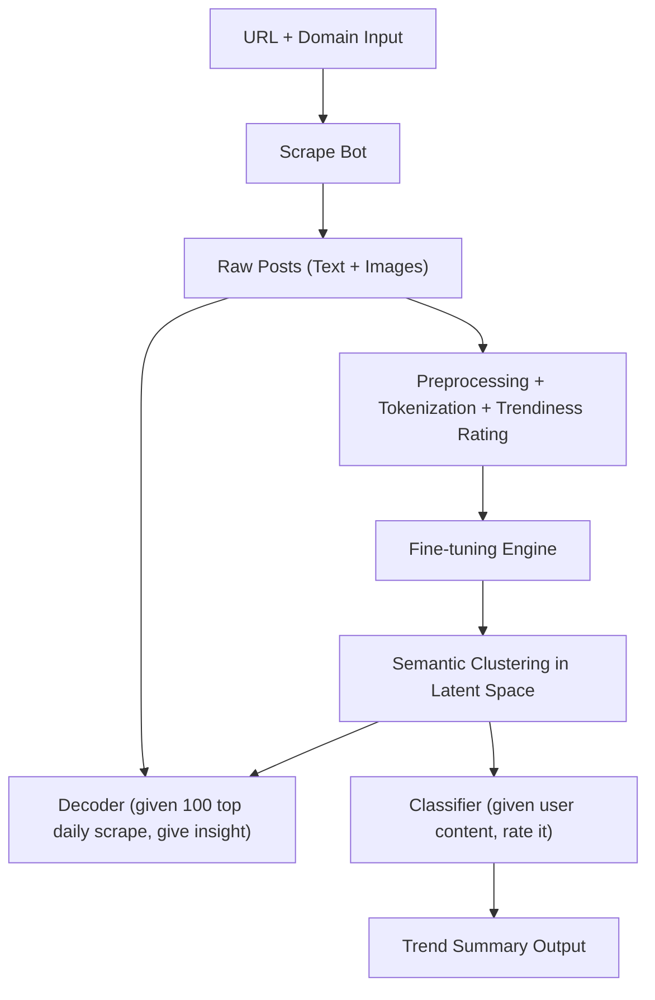

# Design Manual: Trendflow
TrendFlow is designed to be `domain-specific` (accurate to the very subject interested by the user, we can fine-tune with automatic scraping and fine-tune a specific model) and `real-time` (though can be weekly pre-trained/updated, the systemis deisgned to analyze the information online and make inference in real time).

## 🎯 Problem Statement
In the era of rapid content generation, keeping up with trends on social media platforms like Instagram is essential for marketers and media professionals. We aim to build a fully autonomous AI pipeline that conatins training process in serve of making better domain specific training. Although general large langiuage models such as ChatGPT4-O can performquite well on general searching, it is quite hard for them to be used for a very specific domain, this is where we fit in.

1. Weekly API call or real-time content scraping from social media (any web browser that user provides)
2. Fine-tune BERT/CLIP encoder for understanding daily content, by mapping tokens to a popularity score of 0 to 10. This step is deisgned to create a representation for the agent. Think of the fine-tunning step as an encoder/decoder setup, learning an correct relationship between tokens and rating, then we can swap out the classifier with an GPT decoder for generation purpose.
3. Generates concise summaries or keyword tags that represent what’s currently trending in a specific domain or category that the user care about.

## 🧠 Target User
- Primary Audience: Marketing professionals, Media analysts, Content creators, Brand managers

- Use Cases: User goes to the website and enters web URL and interest content in the form of a text message AI Agent scrapes through the website and identifies trending concepts. The scraped information will be provided to Model

## 👤 Use Cases:
There are 2 main use cases:
1. Given a trained model, the user can use the model as a `predictive model` to predict the popularity that their intended text would get.
2. Given a trained model + swapped decoder + scarper, the user can scrape the top 100 post of a given platform and the model (who has past week's domain internal representation and understanding of howgood tokens look like) will generate key insignst about these post.


## 🏗️ System Architecture Overview



---

# Local Setup Guide
Notice that `panda` and `numpy` need to be installed in the same time and `cuda` and `pytorch` need to be installed in the same time. Construct environment by:

```bash
conda env create
```
if you have already setup your local environment, you could update your environment by

```bash
conda activate cse151b_local
conda env update --file environment.yml --prune
```

If you want to run LoRA using the Parameter-Efficient Fine-Tuning(PEFT) library from huggingface, install the dependencies:
```bash
pip install peft==0.13.0
```

Additionally, we need to create a "assets" folder locally to save and download the data.

---

# Running Our System

## WS Bots
...

## RTModels

Run baseline:
```bash
python main.py
```

Run advanced setup:
```bash
python main.py --experiment_config experimental_configs/advanced.yaml --model_config model_configs/advanced.yaml

```

Run LoRA setup:
```bash
python main.py --experiment_config experimental_configs/LoRA.yaml --model_config model_configs/LoRA.yaml
```
