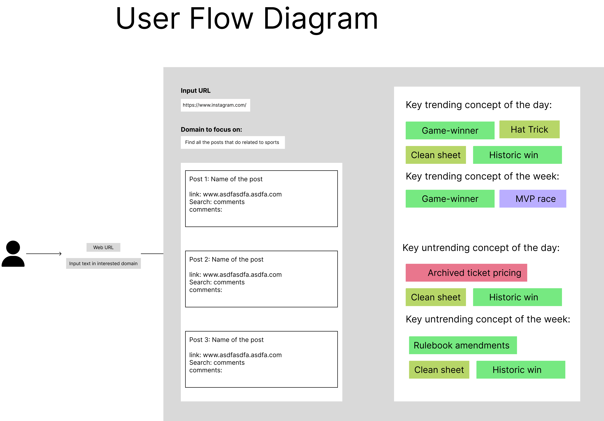
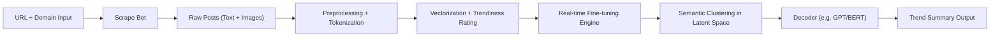

# Design Manual: Trendflow
- Real-Time Trendiness Analyzer for Social Media

## 🎯 Problem Statement
In the era of rapid content generation, keeping up with trends on social media platforms like Instagram is essential for marketers and media professionals. We aim to build a fully autonomous AI pipeline that:
Scrapes real-time content trending (text and images) from social media (Any web browser that user provides)

- Fine-tune Bert encode to fine-tune an BERT/CLIP model of daily content

- Generates concise summaries or keyword tags that represent what’s currently trending in a specific domain or category.

- Vision: Serve as a trend “encoder” module for individuals with no cost

## 🧠 Target User
- Primary Audience: Marketing professionals, Media analysts, Content creators, Brand managers

- Use Cases: User goes to the website and enters web URL and interest content in the form of a text message AI Agent scrapes through the website and identifies trending concepts. The scraped information will be provided to Model

- User Interaction Flow


## 🏗️ System Architecture Overview



---

# Local Setup Guide
Notice that `panda` and `numpy` need to be installed in the same time and `cuda` and `pytorch` need to be installed in the same time. Construct environment by:

```bash
conda env create
```
if you have already setup your local environment, you could update your environment by

```bash
conda activate cse151b_local
conda env update --file environment.yml --prune
```

If you want to run LoRA using the Parameter-Efficient Fine-Tuning(PEFT) library from huggingface, install the dependencies:
```bash
pip install peft==0.13.0
```

Additionally, we need to create a "assets" folder locally to save and download the data.

---

# Running Our System

## WS Bots
...

## RTModels

Run baseline:
```bash
python main.py
```

Run advanced setup:
```bash
python main.py --experiment_config experimental_configs/advanced.yaml --model_config model_configs/advanced.yaml

```

Run LoRA setup:
```bash
python main.py --experiment_config experimental_configs/LoRA.yaml --model_config model_configs/LoRA.yaml
```